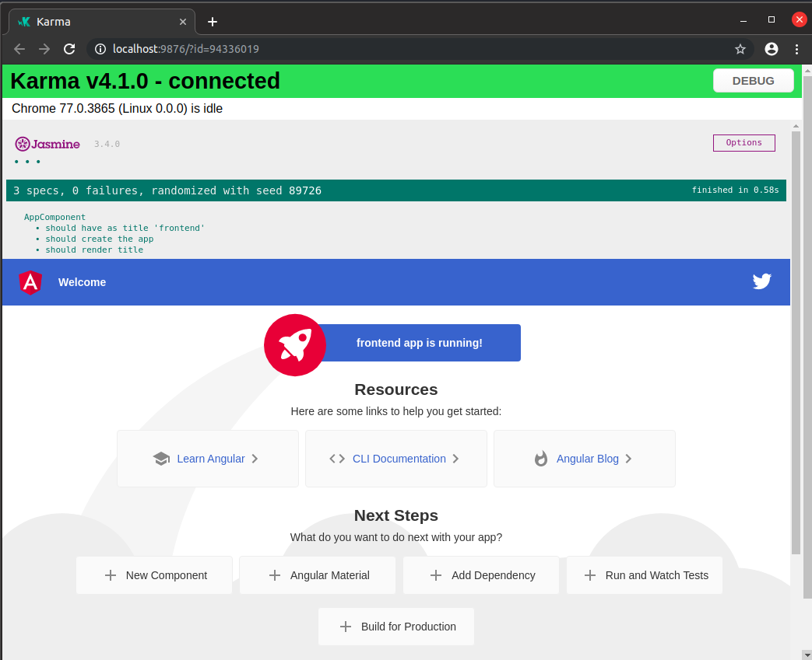
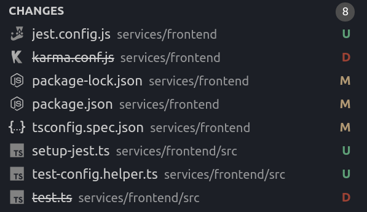
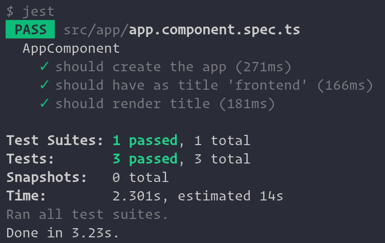

I am operating inside a Typescript Monorepo. I want to add an Angular 8 frontend with Jest testing to the Monorepo. But I am encountering some issues.

I am using

```
Angular CLI: 8.3.5
```

# What I did

> I will use [this repository](https://github.com/flolude/stackoverflow-monorepo-angular-jest/tree/5e6b316b3be5f02a596735eeeb48e6c18dca10a2) as a starting point!

## 1. Create Angular Application

Then in `<root>/services` I ran:

```
ng new frontend
```

After the Angular application was created I was able to run `ng test` with the following result:

Everything works fine.

## 2. Add Jest

> I am using https://github.com/briebug/jest-schematic to easily add Jest to my Angular application

```
yarn global add @briebug/jest-schematic
ng add @briebug/jest-schematic
```

This results in the following changes



Running `jest` results in the following error:

```
$ jest
 FAIL  src/app/app.component.spec.ts
  ● Test suite failed to run

    File not found: <rootDir>/src/tsconfig.spec.json (resolved as: /home/flo/Desktop/stackoverflow-monorepo-angular-jest/services/frontend/src/tsconfig.spec.json)

      at ConfigSet.resolvePath (node_modules/ts-jest/dist/config/config-set.js:712:19)
      at ConfigSet.get (node_modules/ts-jest/dist/config/config-set.js:202:67)
      at ConfigSet.tsJest (node_modules/ts-jest/dist/util/memoize.js:43:24)
      at ConfigSet.get (node_modules/ts-jest/dist/config/config-set.js:297:41)
      at ConfigSet.versions (node_modules/ts-jest/dist/util/memoize.js:43:24)
      at ConfigSet.get (node_modules/ts-jest/dist/config/config-set.js:583:32)
      at ConfigSet.jsonValue (node_modules/ts-jest/dist/util/memoize.js:43:24)
      at ConfigSet.get [as cacheKey] (node_modules/ts-jest/dist/config/config-set.js:598:25)
      at TsJestTransformer.getCacheKey (node_modules/ts-jest/dist/ts-jest-transformer.js:126:36)
      at ScriptTransformer._getCacheKey (node_modules/@jest/transform/build/ScriptTransformer.js:266:23)

Test Suites: 1 failed, 1 total
Tests:       0 total
Snapshots:   0 total
Time:        1.267s
Ran all test suites.
```

## 3. Fixing Errors

Jest tries to find the `tsconfig.spec.json` in a wrong folder. Fortunately I found [a fix](https://github.com/thymikee/jest-preset-angular/issues/286#issuecomment-519050423). I needed to change the `jest.config.js`

```
module.exports = {
  preset: 'jest-preset-angular',
  setupFilesAfterEnv: ['<rootDir>/src/setup-jest.ts'],
  globals: {
    'ts-jest': {
      tsConfig: '<rootDir>/tsconfig.spec.json',
      diagnostics: false,
      stringifyContentPathRegex: '\\.html$',
      astTransformers: [require.resolve('jest-preset-angular/InlineHtmlStripStylesTransformer')],
    },
  },
};
```

Now when I run `jest` it works:



## 4. My Issue

I've now added the Angular `HttClient` to my `AppComponent`:

```
constructor(private http: HttpClient) {}
```

I've also added the `HttpClientModule` to `app.module.ts` and to the `imports` in the `app.component.spec.ts`.

However when running `jest`, I get the following errors:

```
$ jest
 FAIL  src/app/app.component.spec.ts
  AppComponent
    ✕ should create the app (449ms)
    ✕ should have as title 'frontend' (10ms)
    ✕ should render title (10ms)

  ● AppComponent › should create the app

    Can't resolve all parameters for AppComponent: (?).

      at syntaxError (../../../packages/compiler/src/util.ts:100:17)
      at CompileMetadataResolver._getDependenciesMetadata (../../../packages/compiler/src/metadata_resolver.ts:957:27)
      at CompileMetadataResolver._getTypeMetadata (../../../packages/compiler/src/metadata_resolver.ts:836:20)
      at CompileMetadataResolver.getNonNormalizedDirectiveMetadata (../../../packages/compiler/src/metadata_resolver.ts:377:18)
      at CompileMetadataResolver.loadDirectiveMetadata (../../../packages/compiler/src/metadata_resolver.ts:224:11)
      at ../../../packages/compiler/src/jit/compiler.ts:135:36
          at Array.forEach (<anonymous>)
      at ../../../packages/compiler/src/jit/compiler.ts:133:65
          at Array.forEach (<anonymous>)
      at JitCompiler._loadModules (../../../packages/compiler/src/jit/compiler.ts:130:71)
      at JitCompiler._compileModuleAndAllComponents (../../../packages/compiler/src/jit/compiler.ts:115:32)
      at JitCompiler.compileModuleAndAllComponentsAsync (../../../packages/compiler/src/jit/compiler.ts:69:33)
      at CompilerImpl.compileModuleAndAllComponentsAsync (../../../packages/platform-browser-dynamic/src/compiler_factory.ts:69:27)
      at TestingCompilerImpl.compileModuleAndAllComponentsAsync (../../../../packages/platform-browser-dynamic/testing/src/compiler_factory.ts:57:27)
      at TestBedViewEngine.compileComponents (../../../../packages/core/testing/src/test_bed.ts:362:27)
      at Function.TestBedViewEngine.compileComponents (../../../../packages/core/testing/src/test_bed.ts:160:66)
      at testing_1.async (src/app/app.component.spec.ts:11:8)

  ● AppComponent › should create the app

    Can't resolve all parameters for AppComponent: (?).

      at syntaxError (../../../packages/compiler/src/util.ts:100:17)
      at CompileMetadataResolver._getDependenciesMetadata (../../../packages/compiler/src/metadata_resolver.ts:957:27)
      at CompileMetadataResolver._getTypeMetadata (../../../packages/compiler/src/metadata_resolver.ts:836:20)
      at CompileMetadataResolver.getNonNormalizedDirectiveMetadata (../../../packages/compiler/src/metadata_resolver.ts:377:18)
      at CompileMetadataResolver.loadDirectiveMetadata (../../../packages/compiler/src/metadata_resolver.ts:224:11)
      at ../../../packages/compiler/src/jit/compiler.ts:135:36
          at Array.forEach (<anonymous>)
      at ../../../packages/compiler/src/jit/compiler.ts:133:65
          at Array.forEach (<anonymous>)
      at JitCompiler._loadModules (../../../packages/compiler/src/jit/compiler.ts:130:71)
      at JitCompiler._compileModuleAndAllComponents (../../../packages/compiler/src/jit/compiler.ts:115:32)
      at JitCompiler.compileModuleAndAllComponentsSync (../../../packages/compiler/src/jit/compiler.ts:65:38)
      at CompilerImpl.compileModuleAndAllComponentsSync (../../../packages/platform-browser-dynamic/src/compiler_factory.ts:61:35)
      at TestingCompilerImpl.compileModuleAndAllComponentsSync (../../../../packages/platform-browser-dynamic/testing/src/compiler_factory.ts:52:27)
      at TestBedViewEngine._initIfNeeded (../../../../packages/core/testing/src/test_bed.ts:376:28)
      at TestBedViewEngine.createComponent (../../../../packages/core/testing/src/test_bed.ts:570:10)
      at Function.TestBedViewEngine.createComponent (../../../../packages/core/testing/src/test_bed.ts:232:36)
      at it (src/app/app.component.spec.ts:15:29)

  ● AppComponent › should have as title 'frontend'

    Can't resolve all parameters for AppComponent: (?).

      at syntaxError (../../../packages/compiler/src/util.ts:100:17)
      at CompileMetadataResolver._getDependenciesMetadata (../../../packages/compiler/src/metadata_resolver.ts:957:27)
      at CompileMetadataResolver._getTypeMetadata (../../../packages/compiler/src/metadata_resolver.ts:836:20)
      at CompileMetadataResolver.getNonNormalizedDirectiveMetadata (../../../packages/compiler/src/metadata_resolver.ts:377:18)
      at CompileMetadataResolver.loadDirectiveMetadata (../../../packages/compiler/src/metadata_resolver.ts:224:11)
      at ../../../packages/compiler/src/jit/compiler.ts:135:36
          at Array.forEach (<anonymous>)
      at ../../../packages/compiler/src/jit/compiler.ts:133:65
          at Array.forEach (<anonymous>)
      at JitCompiler._loadModules (../../../packages/compiler/src/jit/compiler.ts:130:71)
      at JitCompiler._compileModuleAndAllComponents (../../../packages/compiler/src/jit/compiler.ts:115:32)
      at JitCompiler.compileModuleAndAllComponentsAsync (../../../packages/compiler/src/jit/compiler.ts:69:33)
      at CompilerImpl.compileModuleAndAllComponentsAsync (../../../packages/platform-browser-dynamic/src/compiler_factory.ts:69:27)
      at TestingCompilerImpl.compileModuleAndAllComponentsAsync (../../../../packages/platform-browser-dynamic/testing/src/compiler_factory.ts:57:27)
      at TestBedViewEngine.compileComponents (../../../../packages/core/testing/src/test_bed.ts:362:27)
      at Function.TestBedViewEngine.compileComponents (../../../../packages/core/testing/src/test_bed.ts:160:66)
      at testing_1.async (src/app/app.component.spec.ts:11:8)

  ● AppComponent › should have as title 'frontend'

    Can't resolve all parameters for AppComponent: (?).

      at syntaxError (../../../packages/compiler/src/util.ts:100:17)
      at CompileMetadataResolver._getDependenciesMetadata (../../../packages/compiler/src/metadata_resolver.ts:957:27)
      at CompileMetadataResolver._getTypeMetadata (../../../packages/compiler/src/metadata_resolver.ts:836:20)
      at CompileMetadataResolver.getNonNormalizedDirectiveMetadata (../../../packages/compiler/src/metadata_resolver.ts:377:18)
      at CompileMetadataResolver.loadDirectiveMetadata (../../../packages/compiler/src/metadata_resolver.ts:224:11)
      at ../../../packages/compiler/src/jit/compiler.ts:135:36
          at Array.forEach (<anonymous>)
      at ../../../packages/compiler/src/jit/compiler.ts:133:65
          at Array.forEach (<anonymous>)
      at JitCompiler._loadModules (../../../packages/compiler/src/jit/compiler.ts:130:71)
      at JitCompiler._compileModuleAndAllComponents (../../../packages/compiler/src/jit/compiler.ts:115:32)
      at JitCompiler.compileModuleAndAllComponentsSync (../../../packages/compiler/src/jit/compiler.ts:65:38)
      at CompilerImpl.compileModuleAndAllComponentsSync (../../../packages/platform-browser-dynamic/src/compiler_factory.ts:61:35)
      at TestingCompilerImpl.compileModuleAndAllComponentsSync (../../../../packages/platform-browser-dynamic/testing/src/compiler_factory.ts:52:27)
      at TestBedViewEngine._initIfNeeded (../../../../packages/core/testing/src/test_bed.ts:376:28)
      at TestBedViewEngine.createComponent (../../../../packages/core/testing/src/test_bed.ts:570:10)
      at Function.TestBedViewEngine.createComponent (../../../../packages/core/testing/src/test_bed.ts:232:36)
      at it (src/app/app.component.spec.ts:21:29)

  ● AppComponent › should render title

    Can't resolve all parameters for AppComponent: (?).

      at syntaxError (../../../packages/compiler/src/util.ts:100:17)
      at CompileMetadataResolver._getDependenciesMetadata (../../../packages/compiler/src/metadata_resolver.ts:957:27)
      at CompileMetadataResolver._getTypeMetadata (../../../packages/compiler/src/metadata_resolver.ts:836:20)
      at CompileMetadataResolver.getNonNormalizedDirectiveMetadata (../../../packages/compiler/src/metadata_resolver.ts:377:18)
      at CompileMetadataResolver.loadDirectiveMetadata (../../../packages/compiler/src/metadata_resolver.ts:224:11)
      at ../../../packages/compiler/src/jit/compiler.ts:135:36
          at Array.forEach (<anonymous>)
      at ../../../packages/compiler/src/jit/compiler.ts:133:65
          at Array.forEach (<anonymous>)
      at JitCompiler._loadModules (../../../packages/compiler/src/jit/compiler.ts:130:71)
      at JitCompiler._compileModuleAndAllComponents (../../../packages/compiler/src/jit/compiler.ts:115:32)
      at JitCompiler.compileModuleAndAllComponentsAsync (../../../packages/compiler/src/jit/compiler.ts:69:33)
      at CompilerImpl.compileModuleAndAllComponentsAsync (../../../packages/platform-browser-dynamic/src/compiler_factory.ts:69:27)
      at TestingCompilerImpl.compileModuleAndAllComponentsAsync (../../../../packages/platform-browser-dynamic/testing/src/compiler_factory.ts:57:27)
      at TestBedViewEngine.compileComponents (../../../../packages/core/testing/src/test_bed.ts:362:27)
      at Function.TestBedViewEngine.compileComponents (../../../../packages/core/testing/src/test_bed.ts:160:66)
      at testing_1.async (src/app/app.component.spec.ts:11:8)

  ● AppComponent › should render title

    Can't resolve all parameters for AppComponent: (?).

      at syntaxError (../../../packages/compiler/src/util.ts:100:17)
      at CompileMetadataResolver._getDependenciesMetadata (../../../packages/compiler/src/metadata_resolver.ts:957:27)
      at CompileMetadataResolver._getTypeMetadata (../../../packages/compiler/src/metadata_resolver.ts:836:20)
      at CompileMetadataResolver.getNonNormalizedDirectiveMetadata (../../../packages/compiler/src/metadata_resolver.ts:377:18)
      at CompileMetadataResolver.loadDirectiveMetadata (../../../packages/compiler/src/metadata_resolver.ts:224:11)
      at ../../../packages/compiler/src/jit/compiler.ts:135:36
          at Array.forEach (<anonymous>)
      at ../../../packages/compiler/src/jit/compiler.ts:133:65
          at Array.forEach (<anonymous>)
      at JitCompiler._loadModules (../../../packages/compiler/src/jit/compiler.ts:130:71)
      at JitCompiler._compileModuleAndAllComponents (../../../packages/compiler/src/jit/compiler.ts:115:32)
      at JitCompiler.compileModuleAndAllComponentsSync (../../../packages/compiler/src/jit/compiler.ts:65:38)
      at CompilerImpl.compileModuleAndAllComponentsSync (../../../packages/platform-browser-dynamic/src/compiler_factory.ts:61:35)
      at TestingCompilerImpl.compileModuleAndAllComponentsSync (../../../../packages/platform-browser-dynamic/testing/src/compiler_factory.ts:52:27)
      at TestBedViewEngine._initIfNeeded (../../../../packages/core/testing/src/test_bed.ts:376:28)
      at TestBedViewEngine.createComponent (../../../../packages/core/testing/src/test_bed.ts:570:10)
      at Function.TestBedViewEngine.createComponent (../../../../packages/core/testing/src/test_bed.ts:232:36)
      at it (src/app/app.component.spec.ts:27:29)

Test Suites: 1 failed, 1 total
Tests:       3 failed, 3 total
Snapshots:   0 total
Time:        1.682s, estimated 2s
Ran all test suites.
error Command failed with exit code 1.
```

You can find the repository here:
